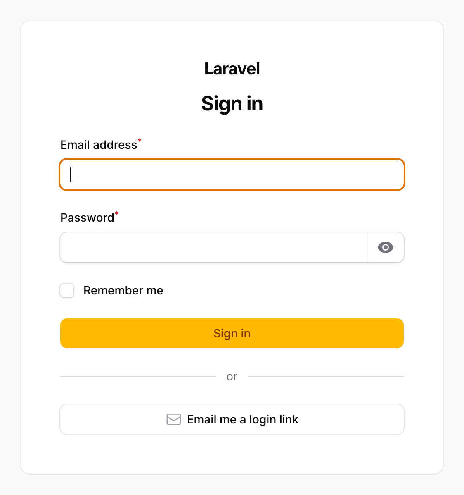
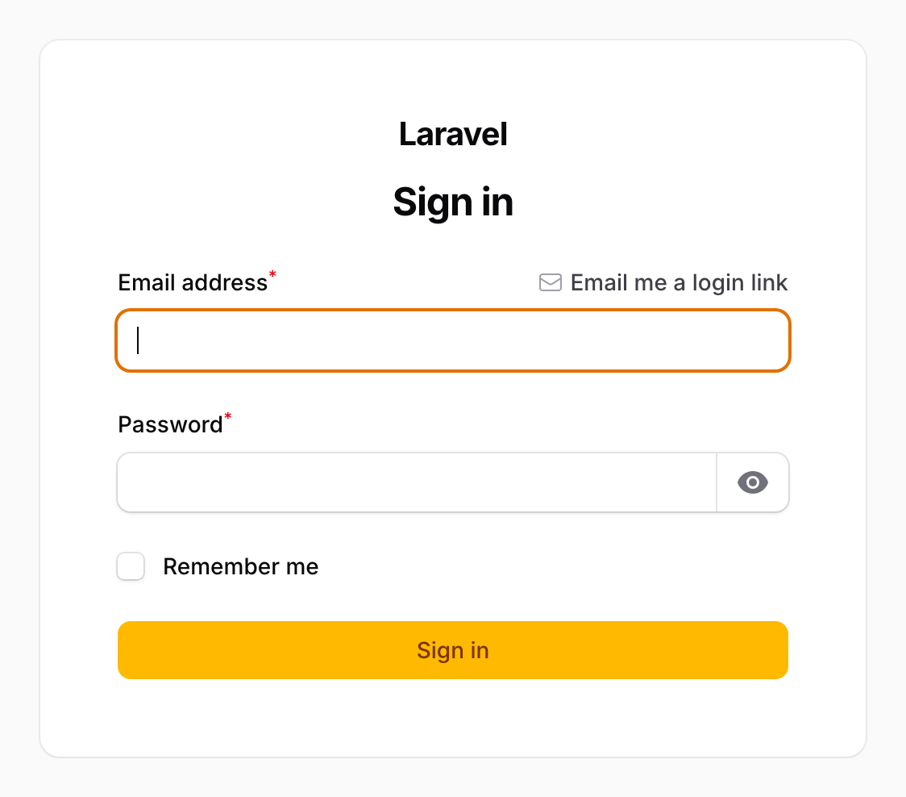

# Filament Magic Login

Passwordless **"email me a login link"** for Filament panels, added *alongside* the standard
email/password form rather than replacing it. Multi-panel aware, single-use hashed tokens,
translated into English, Spanish and Catalan.

The action appears in one of two places, chosen per panel:

| `MagicLinkPosition::BelowForm` (default) | `MagicLinkPosition::EmailFieldHint` |
|---|---|
|  |  |
| A full-width button under the "Sign in" button, set apart by an "or" rule — same shape, no colour. | A labelled link on the email field's hint row. |

Nothing about the password form changes: password login, password reset and registration keep
working exactly as before.

---

## Requirements

| | |
|---|---|
| PHP | 8.3+ |
| Laravel | 12 or 13 |
| Filament | 5 |

## Installation

```bash
composer require arzcode/filament-magic-login
php artisan filament-magic-login:install
```

The install command offers to publish the config file and — unless you have chosen the `cache`
storage driver — to publish and run the migration that creates the `magic_login_tokens` table and
to schedule the token pruner in `routes/console.php`. It then offers to register the plugin on a
panel for you, which is the step that puts the action on your login page, and finally to add the
["send a login link" action](#sending-a-link-to-a-user) to your user resource.

Every step is a question and every one can be declined; nothing here is mandatory. Skip the config
file and the package defaults apply. The two questions that edit your own code — the pruner and the
plugin registration — default to *no*, so with no terminal to answer them (CI, a Docker build) the
command prints the snippet instead of editing anything. It also stays quiet about whatever is
already in place, so re-running the command is safe.

**Your `users` table is never touched.**

### Uninstalling

```bash
php artisan filament-magic-login:uninstall
composer remove arzcode/filament-magic-login
```

The uninstall command undoes what the install command did, in the order that leaves the
application working at every step:

1. Removes `->plugin(MagicLoginPlugin::make())` from your panel providers, the
   `HasMagicLinkAction` trait from any custom login page, and `SendMagicLinkAction::make()` from
   whichever action arrays hold it, along with the now-unused imports. Without this,
   `composer remove` would leave your source pointing at classes that no longer exist and every
   request would fail. An array left with nothing in it is kept rather than deleted — a
   `getHeaderActions()` still has to return one.
2. Drops the `magic_login_tokens` table.
3. Deletes the published config, migration and translations.

Both destructive steps are confirmed first.

| Option | Effect |
|---|---|
| `--force` | Skip every confirmation (for CI or scripted teardown). |
| `--keep-tokens` | Leave the table and its rows alone. |
| `--keep-code` | Do not touch your source; report the panels to unwire by hand instead. |

The code edits work on PHP's token stream, not regular expressions, and the result is parsed
before it is written — a file that would not compile is left untouched. Registrations it cannot
rewrite with certainty (a grouped `use A, B;`, a plugin built through a variable, a conditional
registration) are reported with their file and line numbers rather than guessed at, as are any
other references such as event listeners importing `MagicLinkConsumed`.

## Register the plugin

`filament-magic-login:install` offers to do this for you. To do it by hand, add the plugin to any
panel that already calls `->login()`:

```php
use Arzcode\FilamentMagicLogin\MagicLoginPlugin;

public function panel(Panel $panel): Panel
{
    return $panel
        ->id('admin')
        ->login()
        ->plugin(MagicLoginPlugin::make());
}
```

That is the whole setup. The plugin swaps Filament's stock login page for its own subclass, so
you do not have to create any files. The installer only edits a panel provider it can rewrite with
certainty — a provider that returns its panel from more than one place, for instance, is reported
and left for you. If your panel uses a **custom** login page, see
[Using your own login page](#using-your-own-login-page).

## Sending a link to a user

An administrator can email a specific user a login link from inside a panel, choosing how long it
lives — for somebody being onboarded who has never set a password, for a user whose reset mail
keeps bouncing, for a contractor who needs a way in until Monday.

```php
use Arzcode\FilamentMagicLogin\Actions\SendMagicLinkAction;
```

One class covers all three placements. In the resource's table:

```php
->recordActions([
    EditAction::make(),
    SendMagicLinkAction::make(),
])
```

and in `getHeaderActions()` on the View and Edit pages:

```php
protected function getHeaderActions(): array
{
    return [
        SendMagicLinkAction::make(),
    ];
}
```

In the table row the action renders as an icon button — hover for its label — while the two
page-header actions keep their label. Pass any explicit style (`->button()`, `->iconButton()`,
`->link()`) to override that per placement.

`filament-magic-login:install` offers to do all of that for you. It finds your user resource by
comparing each resource's `$model` against the model your panel's guard authenticates, and follows
a resource to an extracted table class through its own imports. If it cannot identify one resource
with certainty — none match, or two do — it prints the snippet and leaves your source alone.
Re-generating the resource with `make:filament-resource --force` will wipe the wiring; re-run the
installer, or paste it back.

Three things worth being explicit about:

- **The link is emailed to that user, and never shown to the administrator who sent it.** There is
  no "copy link" option, deliberately: this is a way to help somebody log in, not a way to log in
  as them.
- **The administrator is told exactly what happened** — sent, no email address, cannot access this
  panel, or too many links sent — unlike the login page, which stays deliberately silent. That is
  safe here because the person reading it is authenticated and can already see the users table, so
  none of those answers tells them anything new.
- **The expiry is chosen per send** from a row of toggle buttons, with a "custom" choice for
  anything else, and is clamped to `admin.max_expires_after_minutes` (three days by default). The
  clamped value is what gets stored, what the email says, and what the confirmation quotes, so the
  three can never disagree.

| Fluent method | Default | What it does |
|---|---|---|
| `panel(string\|Closure\|null)` | the current panel | Which panel the link is minted for. |
| `expiresAfter(int\|Closure\|null)` | `admin.expires_after_minutes` | Which choice is pre-selected. |
| `maxExpiresAfter(int\|Closure\|null)` | `admin.max_expires_after_minutes` | Ceiling for this placement. |
| `expiryPresets(array\|Closure\|null)` | `admin.expiry_presets` | The buttons offered, in minutes. |
| `askForExpiry(bool\|Closure)` | `true` | `false` sends at the default with no field. |
| `ability(string\|Closure\|null)` | `admin.ability` | Gate ability checked against the target user. |

Everything `Filament\Actions\Action` offers works as usual — `->label()`, `->icon()`,
`->visible()`, `->authorize()`, `->after()`. To change the wording of the confirmations, override
`->action()`.

### Who may send a link

By default the action is visible to anyone who can already reach the row or the record page, which
means it inherits whatever your resource's `canViewAny()` / `canView()` and your panel's auth
middleware already decide. That is where an application with opinions about who may administer
users has already expressed them.

To require a policy ability as well:

```php
// config/filament-magic-login.php
'admin' => ['ability' => 'sendMagicLink'],
```

```php
// app/Policies/UserPolicy.php
public function sendMagicLink(User $administrator, User $target): bool
{
    return $administrator->hasRole('super-admin');
}
```

The default is not that, on purpose: Laravel's Gate denies an ability no policy defines, so
shipping `'sendMagicLink'` as the default would make the action vanish in every application that
installed it.

**If you run more than one panel, set `admin.ability`.** `->panel('app')` lets an administrator of
one panel mint a login credential for another, which is the feature working as intended and
exactly the case worth gating.

Two guards are always on regardless: the action hides itself when the record is not something that
can be authenticated, and a user who fails `canAccessPanel()` on the target panel is refused
outright — an administrator cannot mint a working credential for someone the panel would turn away.

A note on the link itself: the consume route is behind `guest:` middleware, so an administrator who
is signed in and clicks the link they just sent is redirected to the panel home **without**
consuming the token. That is intentional — a link should not silently swap an authenticated
session — but it does mean "open it yourself to check" is not a test. Open it in a private window,
or send it to a user who is signed out.

## Configuration

Every option has a global default in `config/filament-magic-login.php` and a per-panel override
on the plugin. Panel-level setters win; anything you do not set falls back to config.

| Fluent method | Config key | Default | What it does |
|---|---|---|---|
| `expiresAfter(int\|Closure $minutes)` | `expires_after_minutes` | `15` | Link lifetime. |
| `position(MagicLinkPosition\|Closure)` | `position` | `BelowForm` | Where the action renders. |
| `label(string\|Closure\|null)` | — | from translations | Action label. |
| `notification(class-string\|Closure)` | `notification` | `MagicLinkNotification` | Notification used to deliver the link. |
| `rateLimit(int $maxAttempts, int $decaySeconds)` | `rate_limit.*` | `3` / `300` | Limits link *requests*, keyed by email + IP. |
| `consumeRateLimit(int $maxAttempts, int $decaySeconds)` | `consume_rate_limit.*` | `10` / `60` | Limits link *consumption*, keyed by IP. |
| `redirectTo(string\|Closure\|null)` | — | the panel URL | Where to land after a successful login. |
| `routePath(string\|Closure)` | `route_path` | `magic-login` | Route segment under the panel path. |
| `invalidatePrevious(bool\|Closure)` | `invalidate_previous` | `true` | Drop the user's other unused tokens for this panel when a new link is issued. |
| `honorRemember(bool\|Closure)` | `honor_remember` | `true` | Carry the "remember me" checkbox into the magic-link session. |
| `useCustomLoginPage(bool\|Closure)` | — | `false` | Skip login page detection entirely. |
| `adminExpiresAfter(int\|Closure\|null)` | `admin.expires_after_minutes` | falls back to `expires_after_minutes` | Expiry pre-selected in the admin modal. |
| `expiryPresets(array\|Closure)` | `admin.expiry_presets` | `[15, 60, 480, 1440, 4320]` | Toggle buttons offered there, in minutes. |
| `maxAdminExpiresAfter(int\|Closure)` | `admin.max_expires_after_minutes` | `4320` (3 days) | Ceiling for an admin-chosen expiry. |
| `adminRateLimit(int $maxAttempts, int $decaySeconds)` | `admin.rate_limit.*` | `10` / `60` | Limits admin-issued links, keyed by the administrator. `0` disables it. |
| `adminAbility(string\|Closure\|null)` | `admin.ability` | `null` | Gate ability required to send a link. |
| — | `queue` | `true` | Send the shipped notification on the queue. |
| — | `storage.driver` | `database` | `database` or `cache`. Global only, not per panel. |
| — | `blur_timing` | `true` | Pad unknown-address responses so timing does not leak account existence. |

A fuller example:

```php
MagicLoginPlugin::make()
    ->expiresAfter(minutes: 10)
    ->position(MagicLinkPosition::EmailFieldHint)
    ->label('Send me a login link')
    ->notification(MyMagicLinkNotification::class)
    ->rateLimit(maxAttempts: 5, decaySeconds: 600)
    ->redirectTo(fn () => route('filament.admin.pages.dashboard'))
    ->routePath('enlace')
    ->invalidatePrevious(false)
    ->honorRemember(false);
```

Two panels can run different settings at the same time — each panel gets its own plugin
instance and its own consume route (`filament.{panelId}.magic-login.consume`).

## Using your own login page

If the panel already has a custom login page, add the trait to it:

```php
use Arzcode\FilamentMagicLogin\Concerns\HasMagicLinkAction;
use Filament\Auth\Pages\Login;

class MyLogin extends Login
{
    use HasMagicLinkAction;
}
```

The plugin then leaves your page alone. If it finds a custom login page **without** the trait it
throws a `LogicException` at boot rather than silently replacing your page — either add the trait,
or call `->useCustomLoginPage()` to opt out of the check entirely.

Registration order does not matter: `->login(MyLogin::class)->plugin(...)` and
`->plugin(...)->login(MyLogin::class)` behave identically.

## Customising the email

Any notification class works as long as it satisfies the constructor contract:

```php
use Arzcode\FilamentMagicLogin\Contracts\MagicLinkNotification;
use Illuminate\Notifications\Notification;

class MyMagicLinkNotification extends Notification implements MagicLinkNotification
{
    public function __construct(
        public string $url,
        public int $expiresAfterMinutes,
        public string $panelId,
    ) {}

    // ...
}
```

The simplest route is to extend `Arzcode\FilamentMagicLogin\Notifications\MagicLinkNotification`,
which already implements the contract and gives you a translated `MailMessage` to tweak.

Queueing a custom notification is your call — implement `ShouldQueue` on it. The `queue` config
option only decides whether the *shipped* notification is queued.

Notifications are sent through Laravel's notification system, so a notifiable implementing
`HasLocalePreference` receives the email in its own locale automatically.

## Events

Listen to these for audit logging:

| Event | Fired when |
|---|---|
| `MagicLinkRequested($user, $token, $panelId, $issuedBy)` | A link was issued and emailed. |
| `MagicLinkConsumed($user, $token, $panelId)` | A link was redeemed and the user signed in. |
| `MagicLinkRejected($reason, $email, $panelId, $ip)` | Anything was refused. |

`$issuedBy` is the administrator who sent the link, or `null` when the user asked for it
themselves on the login page — `$event->wasIssuedByAdministrator()` says which. It was added as an
optional fourth argument rather than as a separate event on purpose: a new event class would have
left every existing listener with an audit log quietly missing the more privileged half of its
entries.

The attribution lives on this event only, so `MagicLinkConsumed` cannot tell you a redeemed link
was admin-issued. If you need that, record it here keyed by `$event->token->id` and join on
consumption.

`MagicLinkRejected` reasons: `rate_limited`, `unknown_user`, `cannot_access_panel`, `invalid`,
`expired`, `used`. The first three are raised on the request side (where the UI deliberately
stays silent), the rest on the consume side.

```php
Event::listen(MagicLinkRejected::class, function (MagicLinkRejected $event): void {
    Log::channel('security')->warning('magic link rejected', [
        'reason' => $event->reason,
        'email' => $event->email,
        'panel' => $event->panelId,
        'ip' => $event->ip,
    ]);
});
```

## Storage

### `database` (default)

Adds a `magic_login_tokens` table. Each row stores the token **hash**, the panel, the guard, the
remember flag, requesting IP and user agent, an expiry and a `used_at` timestamp — so you can
audit exactly which links were issued and redeemed.

### `cache`

No migration at all. Entries are keyed by hash and expire on their own.

- Use a shared store — **Redis, Memcached or the database cache**. `array` and `file` are refused
  in production, because a multi-process deployment cannot share them.
- Consumption is guarded by `Cache::lock()`, so two simultaneous clicks cannot both win.
- Consumed tokens are kept (marked used) for 24 hours so "already used" and "expired" stay
  distinguishable from "never existed" — after that the distinction is lost.
- No audit trail: listen to the events above if you need one. That applies to admin-issued links
  too — who sent one is carried by `MagicLinkRequested`, never by a stored row.

Set it globally in config; it is not a per-panel option.

```php
'storage' => ['driver' => 'cache'],
```

## Pruning (database driver)

Rows are kept for 24 hours after they expire, then become prunable. The install command offers to
schedule Laravel's pruner for you; to do it by hand, add this to `routes/console.php`:

```php
use Illuminate\Support\Facades\Schedule;
use Arzcode\FilamentMagicLogin\Models\MagicLoginToken;

Schedule::command('model:prune', [
    '--model' => [MagicLoginToken::class],
])->daily();
```

The cache driver needs no pruning.

Note that `filament-magic-login:uninstall` does not remove this — it reports the lines and leaves
them for you to delete, the same as any other code you wrote by hand.

## Security notes

- **Hashed at rest.** Only a SHA-256 hash of the token is stored; the plaintext exists solely in
  the emailed URL. A fast hash is correct here — tokens are 64 random characters (~380 bits), not
  passwords — and it keeps lookup by hash possible without a separate selector column.
- **Single-use.** Consumption is a conditional update (`where used_at is null`) on the database
  driver and a lock-guarded write on the cache driver, so a double-click or a prefetch race
  redeems the link exactly once.
- **Panel and guard bound.** A token minted for one panel is rejected on every other panel, and a
  guard mismatch is rejected outright.
- **`canAccessPanel()` is honoured** both when issuing and when redeeming, so access revoked after
  a link was sent still blocks the login.
- **No user enumeration.** Unknown addresses, users who cannot access the panel and rate-limited
  requests all produce the same confirmation message, and unknown addresses are padded in time.
- **Rate limited on both sides**: requests by email + IP, redemptions by IP.
- **Existing users only.** A magic link never creates an account.
- **An admin-issued link is a credential.** It is gated by whatever already decides who may reach
  your user resource, plus `admin.ability` when you set one — and it is only ever emailed to the
  target user, never shown to the administrator.
- **`requested_ip` and `requested_user_agent` record the sender**, so on an admin-issued row they
  describe the administrator rather than the recipient. That is the useful value: who asked for
  this link.
- **The two rate limits are separate.** An administrator's sends are counted against the
  administrator, in their own key namespace, so they never eat into the recipient's own allowance
  for asking on the login page.
- **`remember` is never carried into an admin-issued link.** Whether a session persists is the
  recipient's own choice on the login form.
- **A queued notification means `Sent` is "handed to the queue"**, not "delivered". With
  `queue => true`, a broken queue will still report success to the administrator.

### Multi-factor authentication

**A magic link does not trigger the 2FA challenge, by design.** Receiving and clicking a link sent
to the account's mailbox already proves possession of a second factor, so asking for a TOTP code on
top would be a second challenge for the same guarantee.

Concretely: Filament 5 runs its multi-factor challenge inside the login page's `authenticate()`
method rather than in middleware, and this package authenticates through the panel guard directly.
Password logins on the same panel keep their challenge, untouched.

Bypassing the *challenge* does not bypass the *enrolment* requirement. A panel configured with
`->multiFactorAuthentication([...], isRequired: true)` still sends a magic-link user to the set-up
page until they have registered a second factor, exactly as it would after a password login. Both
behaviours are covered by tests.

If your threat model wants a TOTP code even after a mailbox-proven login, don't register this
plugin on that panel — there is no option to re-add the challenge.

### Email scanners

Outlook SafeLinks, Apple Mail Privacy Protection and similar scanners follow links before a human
does. `HEAD` requests are answered with `204 No Content` without consuming the token, which covers
the common case. A scanner issuing a real `GET` will still burn the link; a `confirmBeforeLogin()`
option (GET shows a "Continue" button, POST consumes) is planned for a later release.

## Testing

```bash
composer test      # the whole suite against both storage drivers
composer analyse   # Larastan, level 6
composer format    # Pint
```

## Contributing

Pull requests are welcome. Please keep `composer test`, `composer analyse` and
`composer format --test` green, and add any new user-facing string to all three language files —
a test asserts they carry identical keys.

## License

MIT. See [LICENSE](LICENSE).
